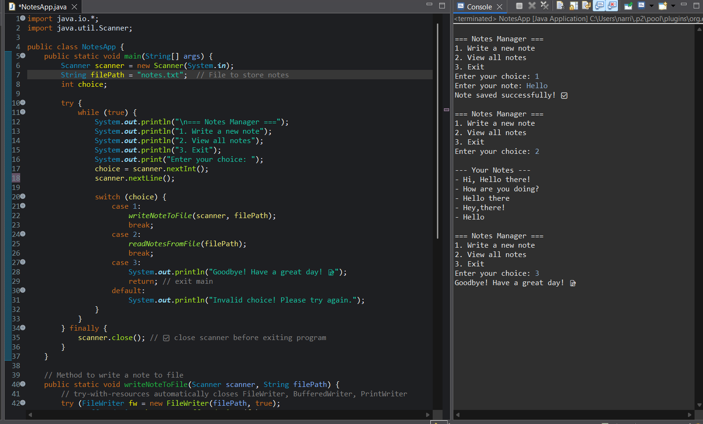

# 📝 NotesApp

  

A beginner-friendly **Java File I/O project** that allows users to **create, save, and manage notes** directly from the console.  
This project demonstrates the use of **FileWriter**, **BufferedWriter**, and **PrintWriter** for writing data to files in Java.

---

## 🚀 Features

- ✏️ Write notes directly from console input  
- 💾 Automatically create and update a text file (`notes.txt`)  
- 🛡️ Proper handling of resources (Scanner and writers closed correctly)  
- 🔍 Demonstrates **file handling**, **loops**, and **user input**  

---

## 🧠 Concepts Used

- Java File I/O (`FileWriter`, `BufferedWriter`, `PrintWriter`)  
- Exception handling (`try-with-resources`)  
- Loops and condition checking  
- Scanner class for user input  

---

## 🖥️ Screenshot

Here’s how the project looks:

---

## 📂 Project Structure

NotesApp/
│
├── src/
│ └── NotesApp.java
│
├── notes.txt
├── noteapp.png
└── README.md

## 🌟 Example Output

Enter a note to save (or 'exit' to stop):
Buy milk
Enter a note to save (or 'exit' to stop):
Finish Java project
Enter a note to save (or 'exit' to stop):
exit
Notes saved successfully in notes.txt!

